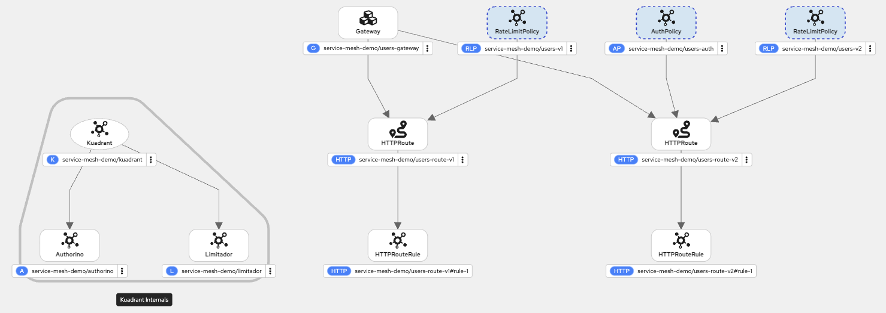

# Red Hat Connectivity Link Demo

**Red Hat Connectivity Link** (which is based on the open-source Kuadrant project) leverages the Kubernetes Gateway API standards to enforce its connectivity policies, such as DNS management, TLS security, authentication, rate limiting and so on.

## Policy Topology
The following topology will be implemented in the demo described in this repository.



## Setup Istio

:bell: Istio will be used as the Gateway Provider.

Create Namespaces:
```bash
oc apply -f config/istio/Namespace.yaml
```

Configure Istio:
```bash
oc apply -f config/istio/Istio.yaml
```

Configure IstioCNI:
```bash
oc apply -f config/istio/IstioCNI.yaml
```

Configure Gateway:
```bash
oc apply -f config/istio/Gateway.yaml
```

Verify:
```bash
oc wait --for=condition=programmed gtw users-gateway -n service-mesh-demo
#Output
gateway.gateway.networking.k8s.io/users-gateway condition met
```

## Setup Kuadrant
Configure `Kuadrant`:
```bash
oc apply -f config/kuadrant/Kuadrant.yaml
```

Verify:
```bash
oc wait kuadrant/kuadrant --for="condition=Ready=true" -n service-mesh-demo --timeout=300s
# Output
kuadrant.kuadrant.io/kuadrant condition met
```

## Setup Apps

Create BuildConfigs:
```bash
oc apply -f config/apps/Build.yaml
```

Build Apps:
```bash
for v in v1 v2; do oc start-build bc/users-$v; done
```

Deploy Apps:
```bash
oc apply -f config/apps/Users.yaml
```

### Test
Get `Gateway` address and port:
```bash
INGRESS_HOST=$(oc get gtw users-gateway -o jsonpath='{.status.addresses[0].value}')
INGRESS_PORT=$(oc get gtw users-gateway -o jsonpath='{.spec.listeners[?(@.name=="http")].port}')
export GATEWAY_URL=$INGRESS_HOST:$INGRESS_PORT
```

Test V1 API:
```bash
curl "$GATEWAY_URL/v1/user/1"
#Output
{surname=Rossi, name=Mario}
```

Verify pod logs:
```bash
oc logs -f deployment/users-v1
#Output
#...output omit...
2026-03-24 09:57:24,262 INFO  [org.acme.UserResourceV1] (executor-thread-1) Get User by ID: 1
```

Test V2 API:
```bash
curl "$GATEWAY_URL/v2/user/1"
#Output
{surname=Rossi, name=Mario, username=mrossi}
```

Verify pod logs:
```bash
oc logs -f deployment/users-v2
#Output
#...output omit...
2026-03-24 11:00:54,601 INFO  [org.acme.UserResourceV2] (executor-thread-1) Get User by ID: 1
```

## Setup Kuadrant Policies

Configure `RateLimitPolicy`:
```bash
oc apply -f config/kuadrant/RateLimitPolicy.yaml
```

Test V1 API Rate Limit:
```bash
while :; do curl -k --write-out '%{http_code}\n' --silent --output /dev/null  "$GATEWAY_URL/v1/user/1" | grep -E --color "\b(429)\b|$"; sleep 1; done
# Output
200
200
200
429
```

Configure `AuthPolicy`:
```bash
oc apply -f config/kuadrant/AuthPolicy.yaml
```

Test V2 API Rate Limit (user: guest):
```bash
while :; do curl -k --write-out '%{http_code}\n' --silent --output /dev/null "$GATEWAY_URL/v2/user/1" | grep -E --color "\b(429)\b|$"; sleep 1; done
# Output
401
```

Test V2 API Rate Limit (user: alice):
```bash
while :; do curl -k --write-out '%{http_code}\n' --silent --output /dev/null -H "Authorization: APIKEY IAMALICE" "$GATEWAY_URL/v2/user/1" | grep -E --color "\b(429)\b|$"; sleep 1; done
# Output
200
200
200
200
200
429
```

Test V2 API Rate Limit (user: bob):
```bash
while :; do curl -k --write-out '%{http_code}\n' --silent --output /dev/null -H "Authorization: APIKEY IAMBOB" "$GATEWAY_URL/v2/user/1" | grep -E --color "\b(429)\b|$"; sleep 1; done
# Output
200
200
200
200
200
200
200
200
200
200
429
```

## Setup Keycloak
```bash
oc apply -f config/keycloak/Keycloak.yaml
```

## Setup Backstage
Configure Backstage:
```bash
oc apply -f config/backstage/Backstage.yaml 
```

Create and apply secret with keycloak client credentials:
```bash
oc apply -f config/backstage/Secret.yaml 
```

## Setup Observability

### Logging
TBD.

### Metrics

Enable user workload monitoring:
```bash
oc apply -f config/kuadrant/observability/ConfigMap.yaml 
```

Apply procedure described [here](https://docs.redhat.com/en/documentation/red_hat_connectivity_link/1.3/html-single/observability/index#configure-obs-monitoring_rhcl-observability) to setup Grafana, PodMonitor and ServiceMonitor.

### Traces

Create and apply secret with s3 credential for Tempo storage and Tempo query-frontend mTLS certs for Grafana DS:
```bash
oc apply -f config/observability/Secret.yaml 
```

Setup Tempo Stack:
```bash
oc apply -f config/observability/TempoStack.yaml 
```

Setup OpenTelemetry:
```bash
oc apply -f config/observability/OpenTelemetryCollector.yaml 
```

Configure tracing for Istio Envoy proxy:
```bash
oc apply -f config/istio/Telemetry.yaml 
```

Configure secret for Grafana Tempo DS:
```bash
oc get secret -n openshift-tempo-operator tempo-tempo-stack-instance-gateway-mtls -o jsonpath='{.data.tls\.crt}' | base64 -d > tls.crt
oc get secret -n openshift-tempo-operator tempo-tempo-stack-instance-gateway-mtls -o jsonpath='{.data.tls\.key}' | base64 -d > tls.key

oc get tempostack/tempo-stack-instance -n openshift-tempo-operator -o jsonpath='{.spec.tenants.authentication}'

oc create secret generic tempo-auth -n monitoring --from-file=tls.crt=tls.crt --from-file=tls.key=tls.key --from-literal=default="12345678-1234-1234-1234-123456789012"
```

Configure DS for Tempo on Grafana: 
```bash
oc apply -f config/observability/GrafanaDatasource.yaml 
```

## Documentations

When using the Gateway API custom resource definitions (CRDs) provided in OpenShift Container Platform 4.19 or newer (Kubernetes 1.26+).

- [Community Docs](https://docs.kuadrant.io/)
- [Official Docs](https://docs.redhat.com/en/documentation/red_hat_connectivity_link/1.3)
- [Supported Configurations](https://access.redhat.com/articles/7092611)